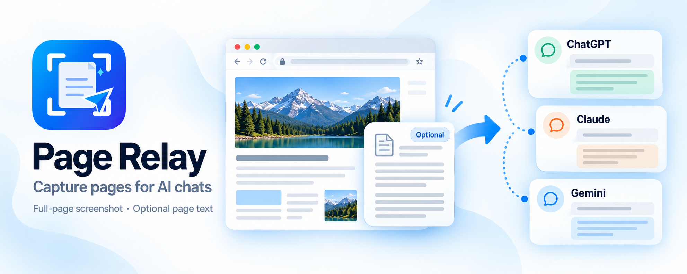

# Page Relay

**Capture pages for AI chats**

[**Install from Chrome Web Store**](https://chromewebstore.google.com/detail/pagerelay/hojfgpdjipcngccgnnlplnphlbebknkn)



## What is Page Relay?

Page Relay is a Chrome Side Panel extension that captures a full-page PNG and
collects rendered page text during the same capture. Every successful chat
preparation includes the screenshot. Turn on **Include page text** to attach the
collected text as a TXT file too.

Page Relay prepares files in the selected chat's draft. You review the draft and
press Send yourself; the extension never sends a message or starts model
generation.

## Features

- **Full-page screenshots:** Scrolls and stitches the page, including internal
  scroll containers and split app/sidebar layouts.
- **Dynamic content:** Handles lazy-loaded and virtualized rows as the page is
  traversed, while preserving the original scroll position.
- **Sharp captures:** Keeps the correct devicePixelRatio/Retina resolution and
  handles fixed and sticky page elements.
- **Optional page text:** Collects rendered text during capture. The TXT
  attachment is off by default for each new capture and can be enabled afterward
  without recapturing.
- **Draft preservation:** Adds the new files alongside existing draft text and
  attachments without writing into the message editor. Uncertain uploads are
  marked **Needs review**; repeat attempts are protected against duplicates.
- **Side Panel workflow:** Captures the tab you clicked, keeps that source fixed
  for the session, and lets you select open AI conversations afterward.
- **User-controlled sending:** Does not click Send, simulate Enter, or start
  model generation.
- **Local extension:** No Page Relay backend, analytics, or telemetry.

## Supported AI services

- **ChatGPT:** `chatgpt.com`, `chat.openai.com`
- **Claude:** `claude.ai`
- **Gemini:** `gemini.google.com`

Only supported chats that are open in Chrome appear as destinations. The
extension has no partially implemented provider entries.

## How it works

1. Open the webpage you want to capture and keep its tab active.
2. Click the Page Relay toolbar icon to open the Side Panel. Capture starts
   automatically; keep the source tab active until it finishes.
3. Optionally turn on **Include page text**. It starts off for every new capture.
4. Click **Refresh** and select one or more open AI conversations.
5. Click **Add to N chats**. The PNG is prepared in each selected chat; TXT is
   added only when **Include page text** is on.
6. Review each chat's draft and press Send there yourself.

When included, TXT contains the page title, source URL, an optional truncation
note, and the unchanged extracted text; no delivery ID is written into it.
Existing drafts and attachments remain in place.
ChatGPT and Claude preparations can run concurrently; Gemini follows with
coordinated tab activation. If a result says **Needs review**, inspect that chat
before trying another action.

## Privacy

Screenshot stitching and text collection happen in your browser. Rendered text
is collected during capture even when **Include page text** is off, but it is not
passed to a provider tab for attachment preparation in that mode. The capture
stays in panel memory for the session, until the panel closes or reloads.

Clicking **Add to N chats** can upload the PNG, and optional TXT, to the selected
AI provider before you press Send. Page Relay has no backend and collects no
analytics or telemetry. See [PRIVACY.md](PRIVACY.md) for data handling and
permissions.

## Installation from Chrome Web Store

Use the [Chrome Web Store listing](https://chromewebstore.google.com/detail/pagerelay/hojfgpdjipcngccgnnlplnphlbebknkn)
for the recommended installation method.

## Installation from source

1. Clone the repository:

   ```bash
   git clone https://github.com/okmsbun/page-relay.git
   ```

2. Open `chrome://extensions` in Chrome 116 or newer.
3. Enable **Developer mode** and click **Load unpacked**.
4. Select the cloned `page-relay` directory containing `manifest.json`.

## Development / Tests

The extension is plain JavaScript with no compilation, bundling, or runtime
dependencies. Run the existing tests from the repository root:

```bash
node --test tests/*.test.cjs
node tests/browser-check.cjs
node tests/provider-controls.cjs
```

`tests/sidepanel-e2e.cjs` is an optional check that loads the extension into an
isolated Chrome profile; it is not part of the default suite.

[INTEGRATIONS.md](INTEGRATIONS.md) documents provider adapters and their
verification requirements.

For Chrome Web Store packaging and release instructions, see [RELEASING.md](RELEASING.md).

## License

MIT — see [LICENSE](LICENSE).
